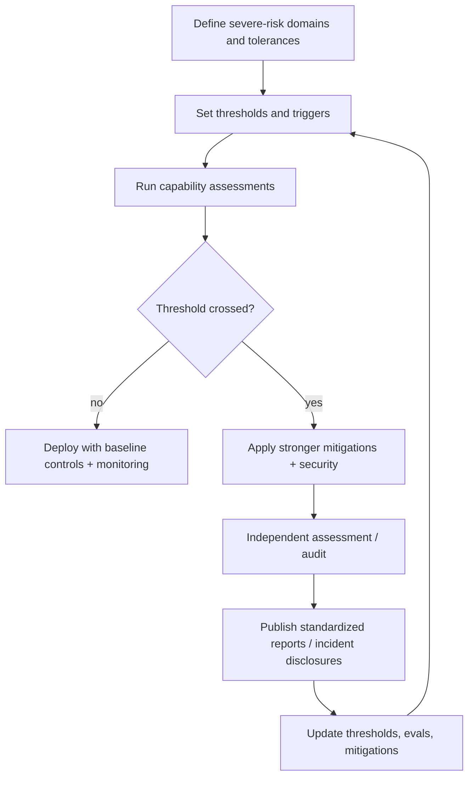

# High-Signal Literature Review and Annotated Bibliography for AI Safety Governance

## Executive summary

- Within the 2024-01-01 to 2026-02-13 window, “frontier” governance practice converged on **ex ante risk frameworks** that define (i) **capability/threshold triggers**, (ii) **evaluation regimes**, and (iii) **required mitigations** as models approach “severe/catastrophic” misuse or loss-of-control risks. citeturn4search29turn19search3turn20search0turn10search12turn7search12turn10search25  
- The most operationalized advances are not new laws but **implementation playbooks** (technical reports and templates) specifying how to do **capability assessments**, **mitigation assessment**, and **third‑party assessments**—notably in the Frontier Model Forum’s report series and in safety‑case / audit methodologies on arXiv. citeturn7search3turn7search0turn7search9turn14view0turn9search0turn18search17  
- A parallel line of work strengthens accountability by importing **assurance engineering** (safety cases, confidence arguments, defense‑in‑depth) into frontier AI governance, while explicitly documenting the **limits of confidence** and the need for **continuous updating** as models and contexts evolve. citeturn5search1turn9search1turn6search1turn5search0  
- International and multi-stakeholder governance shifted from “principles” toward **standardized reporting mechanisms**, including the **Hiroshima AI Process (HAIP) reporting framework** hosted on OECD.AI and incident-reporting templates intended to be comparable across organizations and jurisdictions. citeturn19search4turn19search28turn15search17turn15search1  
- **Compute governance** matured from high-level proposals to detailed analyses of **why compute is governable** (concentration, measurability) and how **compute thresholds** can function as scoping triggers in regulation and policy (while remaining an imperfect proxy for risk). citeturn16search0turn4search2turn16search15turn16search1  
- Formal policy instruments in-scope during this window (e.g., EU AI Act; US OMB guidance) increasingly reference or align with evaluation/assurance ideas, but core open problems remain: **credible independent access**, **robust threshold calibration**, **auditability without overexposing sensitive details**, and **incentive-compatible disclosure**. citeturn1search3turn4search0turn15search0turn5search2turn18search17  
- A persistent gap across the corpus is the field’s limited ability to produce **quantitative, decision-grade risk estimates** that map evaluation scores → real-world harms under adversarial adaptation; many works explicitly treat current thresholds as “nascent,” “iterative,” or “best-effort” placeholders. citeturn7search12turn7search5turn5search1turn16search1  

## Methods and scope

This review uses the explicit window **2024-01-01 through 2026-02-13 (inclusive)**, and **only** includes works within the user-specified umbrellas:  
A) Technical safety (model behavior) and B) Societal & governance safety. For this round, I **prioritize B (Societal & governance safety)** and deliver the Tier-one core set for that slice first.

Systematic search was performed across: arXiv (targeted queries around “safety cases,” “auditing,” “frontier safety frameworks,” “thresholds,” “compute governance”), official repositories and publishers (e.g., NIST, OECD, gov.uk, whitehouse.gov), and major lab / industry framework publication endpoints (e.g., OpenAI/Anthropic/DeepMind framework PDFs; Frontier Model Forum technical report series). Snowballing was conducted from canonical governance artifacts (e.g., frameworks and reporting standards) to policy-methodology papers (e.g., compliance reviews, audit levels, safety-case templates). Duplicates between arXiv and later venue versions were **deduplicated in favor of the canonical venue** when clearly available; otherwise, the **arXiv version within-window** is cited and status is labeled.

Selection & ranking for Tier one (core) emphasizes: (i) method-defining governance frameworks/standards, (ii) operational guidance (controls, evaluation procedures, reporting schemas), (iii) auditability/assurance mechanisms, and (iv) evidence of real adoption or direct integration into compliance or evaluation practice (e.g., referenced by institutions or embedded in official reporting frameworks). citeturn7search12turn19search4turn19search3turn20search0turn10search12  

## Comparison table of major governance artifacts

| Framework / artifact | Issuing org | Year | Scope | Operational controls it specifies | Key limitations / gaps |
|---|---|---:|---|---|---|
| Preparedness Framework v2 | entity["company","OpenAI","ai lab, san francisco"] | 2025 | Frontier capability risk controls (tracked categories; thresholds; safeguards) | Thresholds, capability elicitation, deployment gating, third‑party evaluation pathways | Self-governance; limited enforceability; hard mapping from eval scores to real-world risk citeturn19search3 |
| Responsible Scaling Policy (RSP-2024) | entity["company","Anthropic","ai lab, san francisco"] | 2024 | Catastrophic risk governance via AI Safety Levels (ASL) | ASL levels, capability thresholds, security & deployment standards, pause/hold logic | Standards still evolving; verification and external access constraints citeturn20search0 |
| Frontier Safety Framework v3.0 | entity["company","Google DeepMind","ai lab, london"] | 2025 | Severe-risk protocols via Critical Capability Levels (CCLs) | CCL thresholds, security & deployment mitigations, evaluation practices | Threshold calibration uncertainty; domain coverage still partial and iterative citeturn10search12 |
| Implementing Frontier Capability Assessments | entity["organization","Frontier Model Forum","industry nonprofit, us"] | 2025 | How to evaluate whether models cross dangerous-capability thresholds | Assessment taxonomy; threat modeling; evaluation families; interpretation | “Snapshot” / emergent consensus; not a unified standard; limited transparency on member methods citeturn7search3 |
| Risk Taxonomy and Thresholds for Frontier AI Frameworks | Frontier Model Forum | 2025 | What risks “count” for frontier frameworks; how thresholds are defined | Risk domain selection logic; threshold rationale; governance framing | Lacks standardized quantitative definitions; acknowledges open questions on acceptable tradeoffs citeturn7search12 |
| Frontier Mitigations (technical report) | Frontier Model Forum | 2025 | Practices to implement & assess mitigations across risk domains | Mitigation categories; evaluation of mitigation effectiveness | Explicitly omits broader organizational controls (culture/security) citeturn7search0 |
| HAIP Reporting Framework portal | entity["organization","OECD","intergov org, paris"] | 2025 | Standardized voluntary reporting vs G7 code of conduct | Questionnaire-backed reporting; public comparability | Voluntary; reporting quality depends on incentives and disclosure boundaries citeturn19search4 |
| AI RMF GenAI Profile (NIST AI 600-1) | entity["organization","NIST","us standards agency"] | 2024 | GenAI risk profile aligned to AI RMF | Risk categories + actions; cross-sector risk mgmt guidance | Not enforcement; requires tailoring; organizations may selectively adopt controls citeturn19search2 |
| AI Incidents: mandatory reporting components | entity["organization","Center for Security and Emerging Technology","georgetown policy center, washington dc"] | 2025 | Incident reporting schema for governance programs | Incident fields; reporting templates; comparability aims | Depends on legal authority / compliance; quality and under-reporting risks citeturn15search1 |
| Frontier AI Auditing (AAL levels) | (Independent / multi‑org authorship) | 2026 | Third‑party auditing model for frontier labs | AI Assurance Levels (AAL‑1..4); access norms; verification vs evaluation | Requires deep secure access; institutional capacity and incentives uncertain citeturn18search17 |

## Tier one core bibliography

This round delivers **Tier one (core), 45 fully annotated entries** for **Societal & governance safety** within the specified date window. Tier two (75) and Tier three (100) are not included here due to single-message length constraints; they are specified as the next continuation deliverable in the final section.

**Auditing and assurance frameworks**

1) entity["people","Miles Brundage","ai governance researcher"] et al. (2026). *Frontier AI Auditing: Toward Rigorous Third-Party Assessment of Frontier AI Systems*. Preprint (arXiv:2601.11699; status: preprint). DOI: 10.48550/arXiv.2601.11699. citeturn18search17  
Takeaway: Proposes “frontier AI auditing” and a tiered AI Assurance Levels scheme for legible third‑party verification. citeturn18search17  
Safety relevance: Defines practical audit maturity targets and access expectations for justified trust in frontier safety claims. citeturn18search17  
Gap/limitation: Assumes availability of deep secure access and qualified auditors; institutional scaling and incentives remain open. citeturn18search17  

2) entity["people","Aidan Homewood","ai governance researcher"] et al. (2025). *Third-party compliance reviews for frontier AI safety frameworks*. Preprint (arXiv:2505.01643; status: preprint). DOI: 10.48550/arXiv.2505.01643. citeturn5search2  
Takeaway: Analyzes design choices for independent reviews of whether companies comply with their own safety frameworks. citeturn5search2  
Safety relevance: Offers implementable options for reviewer choice, evidence sources, disclosure, and review cadence. citeturn5search2  
Gap/limitation: Review efficacy hinges on access, evaluator competence, and protecting sensitive information from leakage. citeturn5search2  

3) entity["people","Stephen Barrett","ai assurance researcher"] et al. (2025). *Assessing confidence in frontier AI safety cases*. Preprint (arXiv:2502.05791; status: preprint). DOI: 10.48550/arXiv.2502.05791. citeturn5search1  
Takeaway: Applies safety-case thinking to frontier AI and interrogates how to quantify or communicate confidence in top claims. citeturn5search1  
Safety relevance: Introduces reproducibility ideas (e.g., structured expert elicitation) for confidence in safety arguments. citeturn5search1  
Gap/limitation: Quantification remains fragile; dependence on expert judgment and unclear priors persists. citeturn5search1  

4) entity["people","Robin Bloomfield","computer safety researcher"] and entity["people","John Rushby","formal methods researcher"] (2024). *Assurance of AI Systems From a Dependability Perspective*. Preprint (arXiv:2407.13948; status: preprint). DOI: 10.48550/arXiv.2407.13948. citeturn5search0  
Takeaway: Argues for defense-in-depth “minimize trust in AI” architectures and guarded, assured components where possible. citeturn5search0  
Safety relevance: Provides a safety-critical assurance lens to structure layered controls around opaque ML components. citeturn5search0  
Gap/limitation: Many real systems require AI-based perception, limiting how far “non-AI guards” can go. citeturn5search0  

5) entity["people","Marie Davidsen Buhl","ai governance researcher"] et al. (2024). *Safety cases for frontier AI*. Preprint (arXiv:2410.21572; status: preprint). DOI: 10.48550/arXiv.2410.21572. citeturn9search0  
Takeaway: Defines frontier AI safety cases and explains how they complement organization-level frontier safety frameworks. citeturn9search0  
Safety relevance: Clarifies objectives/arguments/evidence/scope components needed for deploy/no-deploy decisions. citeturn9search0  
Gap/limitation: Relies on strong evaluation evidence and clear risk tolerances that are not yet standardized. citeturn9search0  

6) entity["people","Arthur Goemans","ai governance researcher"] et al. (2024). *Safety case template for frontier AI: A cyber inability argument*. Preprint (arXiv:2411.08088; status: preprint). DOI: 10.48550/arXiv.2411.08088. citeturn9academia23  
Takeaway: Provides a concrete CAE/GSN-style template linking cyber risk models → proxy tasks → eval results → safety claims. citeturn9academia23  
Safety relevance: Turns implicit eval logic into explicit assumptions and argument structure for auditing and review. citeturn9academia23  
Gap/limitation: Template quality depends on validity of risk models, benchmarks, and baselines under attacker adaptation. citeturn9academia23  

7) entity["people","Carmen Cârlan","safety assurance researcher"] et al. (2024). *Dynamic safety cases for frontier AI*. Preprint (arXiv:2412.17618; status: preprint). DOI: 10.48550/arXiv.2412.17618. citeturn9search1  
Takeaway: Proposes a Dynamic Safety Case Management System to keep safety cases synchronized with system changes over time. citeturn9search1  
Safety relevance: Operationalizes continuous assurance—critical for iterated deployment and rapidly changing models. citeturn9search1  
Gap/limitation: Automation still depends on high-quality measurable safety performance indicators and change-impact logic. citeturn9search1  

8) entity["people","Benjamin Hilton","ai safety researcher"] et al. (2025). *Safety Cases: A Scalable Approach to Frontier AI Safety*. Preprint (arXiv:2503.04744; status: preprint). DOI: 10.48550/arXiv.2503.04744. citeturn6search1  
Takeaway: Argues safety cases can scale governance by structuring writer/red‑team/decision‑maker interactions across lifecycle stages. citeturn6search1  
Safety relevance: Bridges Seoul-style commitments to a concrete artifact that can be reviewed internally or externally. citeturn6search1  
Gap/limitation: Needs rigorous red teaming and evidence generation; risks of “paper compliance” remain. citeturn6search1  

9) entity["people","Sung Une Lee","software assurance researcher"] et al. (2026). *Constructing Safety Cases for AI Systems: A Reusable Template Framework*. Preprint (arXiv:2601.22773; status: preprint). DOI: 10.48550/arXiv.2601.22773. citeturn6academia22  
Takeaway: Taxonomizes AI-specific claim/argument/evidence types and proposes reusable safety-case templates for generative/agentic systems. citeturn6academia22  
Safety relevance: Improves comparability and maintainability of safety cases across models and updates. citeturn6academia22  
Gap/limitation: Still requires consensus on acceptable thresholds and evidence strength for frontier-risk claims. citeturn6academia22  

10) entity["people","Ibrahim Habli","assurance researcher"] et al. (2025). *The BIG Argument for AI Safety Cases*. Preprint (arXiv:2503.11705; status: preprint). DOI: 10.48550/arXiv.2503.11705. citeturn6academia21  
Takeaway: Proposes a whole-system “Balanced, Integrated, Grounded” argument structure for AI safety cases. citeturn6academia21  
Safety relevance: Emphasizes context, traceability, and proportional assurance for emergent hazardous behaviors. citeturn6academia21  
Gap/limitation: High-level structure; requires domain-specific instantiations and evidence pipelines to be decision-grade. citeturn6academia21  

11) entity["people","Jacob Charnock","ai governance researcher"] et al. (2026). *Expanding External Access To Frontier AI Models For Dangerous Capability Evaluations*. Preprint (arXiv:2601.11916; status: preprint). DOI: 10.48550/arXiv.2601.11916. citeturn15search0  
Takeaway: Provides an access taxonomy and “Access Levels” for external evaluators to run dangerous-capability tests securely. citeturn15search0  
Safety relevance: Directly targets the bottleneck of independent evaluation under confidentiality and security constraints. citeturn15search0  
Gap/limitation: Access levels may still be insufficient for deep audits; governance of evaluator trust remains unresolved. citeturn15search0  

12) entity["people","Charlotte Stix","ai governance researcher"] et al. (2025). *AI Behind Closed Doors: a Primer on The Governance of Internal Deployment*. Preprint (arXiv:2504.12170; status: preprint). DOI: 10.48550/arXiv.2504.12170. citeturn2academia40  
Takeaway: Argues internal deployment is a distinct risk surface and proposes governance concepts and scenarios for it. citeturn2academia40  
Safety relevance: Targets early high-leverage contexts (internal tools, R&D automation) before public deployment. citeturn2academia40  
Gap/limitation: Limited empirical grounding; hard to validate controls without privileged internal operational data. citeturn2academia40  

13) entity["people","Jonas Schuett","ai governance researcher"] (2024). *Frontier AI developers need an internal audit function*. *Risk Analysis* (journal article). DOI: 10.1111/risa.17665. citeturn18search6  
Takeaway: Makes the case that frontier labs should adopt an independent internal audit line reporting to the board. citeturn18search6  
Safety relevance: Imports mature governance practice (Three Lines / combined assurance) to reduce blind spots and “grading own homework.” citeturn18search6  
Gap/limitation: Audit can be captured or under-resourced; auditor technical capability and access are core limiting factors. citeturn18search6  

**Regulation and standards**

14) European Union (2024). *Regulation (EU) 2024/1689 (AI Act)*. Official Journal / EUR‑Lex. CELEX: 32024R1689. citeturn1search3  
Takeaway: Establishes a binding risk-based regulatory framework that elevates governance, transparency, and accountability requirements. citeturn1search3  
Safety relevance: Creates a compliance anchor likely to incorporate frontier evaluation and documentation regimes. citeturn1search3  
Gap/limitation: Implementation detail and measurement standards remain contested; efficacy depends on enforcement and technical TEVV capacity. citeturn1search3  

15) Office of Management and Budget (2024). *M‑24‑10: Advancing Governance, Innovation, and Risk Management for Agency Use of Artificial Intelligence*. U.S. government memorandum (PDF). citeturn4search0  
Takeaway: Requires U.S. agencies to implement AI governance and minimum risk management practices for safety/rights-impacting uses. citeturn4search0  
Safety relevance: Operationalizes governance requirements (roles, inventories, controls) at scale across federal systems. citeturn4search0  
Gap/limitation: Applies to federal use; does not directly solve frontier-model evaluation science or third‑party access. citeturn4search0  

16) NIST (2024). *Artificial Intelligence Risk Management Framework: Generative AI Profile (NIST AI 600-1)*. DOI: 10.6028/NIST.AI.600-1. citeturn19search2  
Takeaway: Defines GenAI-specific risk considerations and action guidance as a profile aligned to the AI RMF. citeturn19search2  
Safety relevance: Provides a shared vocabulary and control ideas that can be used in audits and assurance cases. citeturn19search2  
Gap/limitation: Voluntary and high-level; interpretive flexibility can enable superficial compliance without robust evaluation. citeturn19search2  

17) U.S. AI Safety Institute / NIST (2024). *Managing Misuse Risk for Dual-Use Foundation Models (NIST AI 800-1, Initial Public Draft)*. Government technical draft (PDF). citeturn10search32  
Takeaway: Draft guidance for managing misuse risk of dual-use foundation models with concrete security and safeguard themes. citeturn10search32  
Safety relevance: Anchors “misuse risk” governance in a standards-oriented roadmap that can inform testing and mitigations. citeturn10search32  
Gap/limitation: Draft status; lacks field-wide standards for measuring uplift and “sufficient” safeguard robustness. citeturn10search32  

18) UK Government (2024). *Frontier AI Safety Commitments (AI Seoul Summit 2024)*. Government publication (gov.uk). citeturn4search29  
Takeaway: Documents voluntary commitments by frontier developers to publish frameworks, set thresholds, evaluate, and mitigate severe risks. citeturn4search29  
Safety relevance: Acts as a coordination focal point that accelerated publication of framework artifacts and evaluation norms. citeturn4search29  
Gap/limitation: Voluntary; compliance is hard to verify without standardized access, audits, and enforceable reporting. citeturn4search29  

19) Frontier Model Forum (2025). *Comment on NIST Outline of Draft TEVV Standard* (public comment, PDF). citeturn7search15  
Takeaway: Argues TEVV guidance for advanced general-purpose models needs distinct treatment and domain-aware evaluation practice. citeturn7search15  
Safety relevance: Connects frontier framework practice to standards-making in testing/evaluation/verification/validation. citeturn7search15  
Gap/limitation: Advisory input, not a binding standard; hard questions remain about measurable thresholds and disclosure. citeturn7search15  

**Incident reporting and postmortems**

20) OECD (2025). *Towards a Common Reporting Framework for AI Incidents*. OECD Artificial Intelligence Papers (No. 34; PDF). citeturn15search17  
Takeaway: Proposes a harmonized schema to report AI incidents across jurisdictions and sectors for comparability. citeturn15search17  
Safety relevance: Enables aggregation and learning from failures—precondition for evidence-based regulation and assurance. citeturn15search17  
Gap/limitation: Success depends on adoption, reporting incentives, and managing confidentiality and reputational risk. citeturn15search17  

21) Center for Security and Emerging Technology (2025). *AI Incidents: Key Components for a Mandatory Reporting Regime*. Policy/technical report (PDF). citeturn15search1  
Takeaway: Specifies what information should be captured in mandatory AI incident reporting (fields + structure). citeturn15search1  
Safety relevance: Provides implementable building blocks for regulators designing incident reporting rules. citeturn15search1  
Gap/limitation: Field taxonomy may evolve; under-reporting and inconsistent severity calibration remain likely failure modes. citeturn15search1  

22) OECD (2024). *OECD launches pilot to monitor application of G7 code of conduct on advanced AI development* (press release). citeturn19search8  
Takeaway: Signals early international movement toward monitoring and comparability for “advanced AI” governance. citeturn19search8  
Safety relevance: Establishes an institutional pathway from voluntary codes to structured monitoring regimes. citeturn19search8  
Gap/limitation: Monitoring remains voluntary and dependent on “reporting honesty” and shared definitions. citeturn19search8  

23) OECD (2025). *G7 reporting framework – Hiroshima AI Process (HAIP) international code of conduct* (OECD.AI transparency portal). citeturn19search4  
Takeaway: Implements a live reporting interface for organizations to publicly disclose risk management practices. citeturn19search4  
Safety relevance: Creates a de facto reporting standard and a comparability mechanism at international scale. citeturn19search4  
Gap/limitation: Voluntary reporting can incentivize selective disclosure; no built-in verification without audits. citeturn19search4  

24) Perset et al. / OECD (2025). *How are AI developers managing risks?* OECD report (PDF). citeturn15search2  
Takeaway: Synthesizes submitted reports under HAIP reporting and surfaces emergent patterns in developer risk management. citeturn15search2  
Safety relevance: Provides empirical input for policymakers on what firms claim to do and where practices diverge. citeturn15search2  
Gap/limitation: Based on self-reported submissions; comparability and depth are constrained by disclosure incentives. citeturn15search2  

**Compute governance**

25) entity["people","Girish Sastry","ai governance researcher"] et al. (2024). *Computing Power and the Governance of Artificial Intelligence*. Preprint (arXiv:2402.08797; status: preprint). DOI: 10.48550/arXiv.2402.08797. citeturn16search0  
Takeaway: Argues compute is a uniquely governable lever (measurable, excludable, concentrated supply chain) and maps policy mechanisms. citeturn16search0  
Safety relevance: Frames enforcement, visibility, and allocation tools that can underwrite frontier evaluation and licensing regimes. citeturn16search0  
Gap/limitation: Warns of privacy/economic centralization risks; readiness varies and requires significant implementation research. citeturn16search0  

26) Frontier Model Forum (2024). *Issue Brief: Measuring Training Compute*. Issue brief (web publication). citeturn4search2  
Takeaway: Recommends principles for measuring and reporting training compute to support compute-threshold proposals. citeturn4search2  
Safety relevance: Standardized measurement is prerequisite to any compute-triggered governance and auditability. citeturn4search2  
Gap/limitation: Compute is an imperfect proxy for risk; reporting standards still allow strategic framing and loopholes. citeturn4search2  

27) Lennart Heim and Leonie Koessler (2024/2025). *Training Compute Thresholds: Features and Functions in AI Regulation* (PDF). citeturn16search15  
Takeaway: Analyzes how training-compute thresholds function in regulation (scoping, triggers, administrative feasibility). citeturn16search15  
Safety relevance: Clarifies when compute thresholds are useful (screening) vs dangerous (over- or under-inclusion). citeturn16search15  
Gap/limitation: Performance-to-risk mapping is nonstationary; adversaries and labs can “structure” around thresholds. citeturn16search15  

28) Jonas Schuett et al. (2025). *Survey on Thresholds for Advanced AI Systems*. Research report (PDF). citeturn16search1  
Takeaway: Reports expert and public views on threshold types, purposes, and who should set them. citeturn16search1  
Safety relevance: Provides structured evidence to inform policy choices about thresholds beyond ad hoc lab practice. citeturn16search1  
Gap/limitation: Opinion data does not resolve measurement; disagreements persist on compute’s role and breach responses. citeturn16search1  

**Evaluation standards and benchmarking governance**

29) Frontier Model Forum (2025). *Frontier Capability Assessments* (technical report, PDF). citeturn7search3  
Takeaway: Systematizes how to determine whether models have capabilities that raise severe CBRN/cyber/autonomy risks. citeturn7search3  
Safety relevance: Defines assessment families and threat modeling as an iterative backbone for frontier-governance triggers. citeturn7search3  
Gap/limitation: Not a unified standard; evidentiary strength varies widely by evaluation type and domain maturity. citeturn7search3  

30) Frontier Model Forum (2025). *Risk Taxonomy and Thresholds for Frontier AI Frameworks* (technical report, PDF). citeturn7search12  
Takeaway: Explains why frontier frameworks focus on select severe/irreversible risk domains and how thresholds are chosen. citeturn7search12  
Safety relevance: Provides shared logic for scoping “frontier” risks and setting pause/restrict triggers. citeturn7search12  
Gap/limitation: Lacks standardized quantitative definitions and leaves open “acceptable risk-benefit” criteria. citeturn7search12  

31) Frontier Model Forum (2025). *Frontier Mitigations* (technical report, PDF). citeturn7search0  
Takeaway: Catalogs emerging mitigations and discusses how to assess mitigation effectiveness across severe-risk domains. citeturn7search0  
Safety relevance: Moves beyond “do evals” to “validate safeguards,” reducing pure-evaluation theater. citeturn7search0  
Gap/limitation: Explicitly excludes organizational security/culture; mitigation evaluation can be gamed or overfit to tests. citeturn7search0  

32) Frontier Model Forum (2025). *Third-Party Assessments* (technical report, PDF). citeturn7search9  
Takeaway: Outlines when and how third parties can confirm safety capability claims or mitigation efficacy securely. citeturn7search9  
Safety relevance: Defines a workable path from internal evaluation to external confidence-building mechanisms. citeturn7search9  
Gap/limitation: “Third-party” still constrained by access, NDAs, and methodological independence requirements. citeturn7search9  

33) Frontier Model Forum (2026). *Managing Advanced Cyber Risks in Frontier AI Frameworks* (technical report, PDF). citeturn14view0  
Takeaway: Specializes frontier framework implementation for cyber: threat modeling, cyber thresholds, assessments, and mitigations. citeturn14view0  
Safety relevance: Sharpens consensus around “non-expert uplift” and “autonomous cyberattack” threshold logic. citeturn14view0  
Gap/limitation: Cyber is highly dual-use and fast-moving; maintaining valid threat models and benchmarks is difficult. citeturn14view0  

34) Frontier Model Forum (2025). *Thresholds for Frontier AI Safety Frameworks* (issue brief, PDF). citeturn7search5  
Takeaway: Surveys compute/risk/capability/outcome thresholds and tradeoffs for frontier governance triggers. citeturn7search5  
Safety relevance: Operationalizes “when to intensify controls” as a core governance mechanism. citeturn7search5  
Gap/limitation: Threshold breach detection and multi-threshold coordination remain unresolved research/practice problems. citeturn7search5  

35) Frontier Model Forum (2024). *Preliminary Taxonomy of Pre-Deployment Frontier AI Safety Evaluations* (issue brief, web publication). citeturn15search20  
Takeaway: Defines a shared taxonomy and terminology for pre-deployment safety evaluations to reduce ecosystem confusion. citeturn15search20  
Safety relevance: Enables governance that compares like-with-like across evaluations and organizations. citeturn15search20  
Gap/limitation: High-level taxonomy; does not itself solve validity, gaming resistance, or calibration of evaluation cutoffs. citeturn15search20  

36) Frontier Model Forum (2024). *Early Best Practices for Frontier AI Safety Evaluations* (issue brief, web publication). citeturn16search2  
Takeaway: Documents early consensus practices across eval lifecycle: design, implementation, interpretation, disclosure. citeturn16search2  
Safety relevance: Establishes baseline process norms for evaluators and labs to improve rigor and reproducibility. citeturn16search2  
Gap/limitation: “Early” guidance; does not guarantee robustness under strategic adaptation or hidden capability elicitation. citeturn16search2  

37) Frontier Model Forum (2024). *Foundational Security Practices* (issue brief, web publication). citeturn16search3  
Takeaway: Summarizes emerging baseline security practices for securing frontier AI systems and development processes. citeturn16search3  
Safety relevance: Links security posture to safety by reducing theft/misuse and enabling credible evaluation confidentiality. citeturn16search3  
Gap/limitation: High-level consensus; does not specify testable assurance criteria for “sufficient” security maturity. citeturn16search3  

38) Frontier Model Forum (2026). *Chain of Thought Monitorability* (issue brief, web publication). citeturn4search30  
Takeaway: Discusses monitorability issues for reasoning traces and implications for evaluation and control strategies. citeturn4search30  
Safety relevance: Addresses a key evaluation/oversight question: what evidence is available for auditing model reasoning. citeturn4search30  
Gap/limitation: Largely conceptual; operational monitorability standards and validated measurement remain limited. citeturn4search30  

**Organizational risk management**

39) OpenAI (2025). *Preparedness Framework, Version 2* (technical report, PDF). citeturn19search3  
Takeaway: Defines tracked risk categories, capability thresholds, evaluation processes, and safeguard expectations for frontier deployment decisions. citeturn19search3  
Safety relevance: A widely referenced template for preparedness-style risk gating and structured escalation. citeturn19search3  
Gap/limitation: Policy is not proof; enforcement depends on internal governance and quality of third‑party stress testing. citeturn19search3  

40) Anthropic (2024). *Responsible Scaling Policy (RSP-2024)* (policy + standards, PDF). citeturn20search0  
Takeaway: Updates RSP with AI Safety Levels, capability thresholds, and paired deployment/security standards. citeturn20search0  
Safety relevance: Provides concrete “scale only with safeguards” logic and a structured pause/hold governance mechanism. citeturn20search0  
Gap/limitation: Still relies on internal evaluation and security claims; verification and independent replication remain hard. citeturn20search0  

41) Anthropic (2025). *Responsible Scaling Policy, Version 2.1* (policy + standards, PDF). citeturn20search3  
Takeaway: Refines capability thresholds and clarifies when safeguards beyond ASL-3 are required. citeturn20search3  
Safety relevance: Demonstrates iterative policy maintenance tied to evolving threat models and capability expectations. citeturn20search3  
Gap/limitation: “Minor updates” do not resolve core measurement and access problems; thresholds remain judgement-heavy. citeturn20search3  

42) Google DeepMind (2024). *Frontier Safety Framework v1.0* (technical report, PDF). citeturn7search2  
Takeaway: Introduces Critical Capability Levels and mitigation protocols across autonomy, biosecurity, cybersecurity, and ML R&D. citeturn7search2  
Safety relevance: One of the earliest explicit threshold-and-mitigation frameworks used as reference for later standards. citeturn7search2  
Gap/limitation: Early, exploratory framing; real-world validity depends on evaluation science and safeguard verification. citeturn7search2  

43) Google DeepMind (2025). *Frontier Safety Framework v3.0* (technical report, PDF). citeturn10search12  
Takeaway: Strengthens FSF protocols (CCLs, mitigations, security considerations) as frontier capabilities advance. citeturn10search12  
Safety relevance: Represents a mature “living framework” iteration and is widely referenced in policy discussions. citeturn10search12  
Gap/limitation: Core uncertainty remains: translating CCL eval results into calibrated real-world severe-harm probabilities. citeturn10search12  

44) Microsoft (2025). *Frontier Governance Framework* (corporate technical framework, PDF). citeturn8search18  
Takeaway: Describes monitoring and process controls for emerging high-risk capabilities aligned with frontier commitments. citeturn8search18  
Safety relevance: Contributes concrete governance process design across capability monitoring, assessment, and mitigation. citeturn8search18  
Gap/limitation: Corporate self-governance; auditability and independent validation depend on access and assessor independence. citeturn8search18  

45) NVIDIA (2025). *Frontier AI Risk Assessment* (corporate technical framework; applicable Aug 2025, PDF). citeturn16search16  
Takeaway: Applies a risk framework to identify emerging frontier capabilities and set iterative mitigation review mechanisms. citeturn16search16  
Safety relevance: Illustrates how major infrastructure providers translate frontier risk language into internal governance practice. citeturn16search16  
Gap/limitation: Limited external auditability; effectiveness depends on internal measurement quality and disclosure incentives. citeturn16search16  

## Next research paths and remaining tiers

**What remains to satisfy the full tiering quotas for this round:** Tier two (75 lightly annotated) and Tier three (100 inventory citations) for Societal & governance safety are not included in this single message due to length constraints; the next continuation would expand coverage to additional frontier framework families (e.g., other company frameworks and model-specific risk reports), additional standards/ecosystem artifacts (e.g., further HAIP reporting analyses and assurance-board proposals), and more incident-response / disclosure mechanisms, while preserving the same strict scope and quality filter. citeturn19search4turn15search17turn15search1turn20search1turn19search0  

**Two next paths available (choose one):**  
(A) **Expand Scope 2 breadth (governance)** with the remaining Tier two and Tier three lists, prioritizing additional operational artifacts: framework evaluation rubrics, internal-audit implementation designs, transparency indices used in practice, and additional government/lab assurance templates. citeturn8academia20turn18academia41turn11search15turn3search21  
(B) **Shift to Scope 1 (technical safety)** with the same tiering approach (core + extended + inventory), starting with evals/red-teaming and security/jailbreaks (because they interface most directly with governance controls and standards), then interpretability-for-oversight, scalable oversight, and alignment. citeturn7search3turn14view0turn20search14